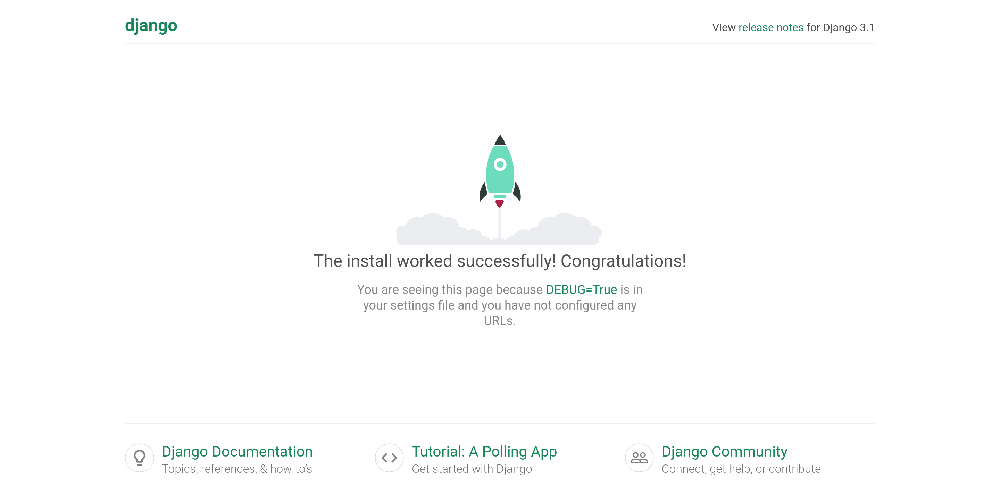
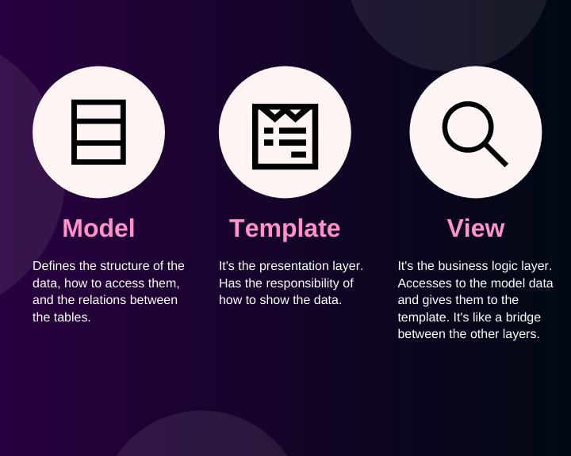

# KAPA-C | Space Travel Agency


#### A fiction project to learn Django creating a web app that controls all the travels from *KAPA-C*, the best travel agency in the galaxy!

---
### Development server
So we have all the setup of our project. If you can test that all the configuration works, run the manage.py script with the next instruction:
```bash
python manage.py runserver
```
This instruction runs the development server of our project. It's a light version of our web app that let us see the changes in our web pages in real time. 

To run in a specific port you can execute the command with an extra parameter. For example, if we can run our project in the port **3000**, we have to execute the next instruction: 
```bash
python manage.py runserver 3000
```

In both cases we are going to have the next output in the terminal:

```
Watching for file changes with StatReloader
Performing system checks...

System check identified no issues (0 silenced).

You have 18 unapplied migration(s). Your project may not work properly until you apply the migrations for app(s): admin, auth, contenttypes, sessions.
Run 'python manage.py migrate' to apply them.
September 05, 2020 - 23:22:45
Django version 3.1.1, using settings 'space_agency.settings'
Starting development server at http://127.0.0.1:3000/
Quit the server with CONTROL-C.

```

> ⚠ Remember activate your virtual environment and be inside the outer `space_agency` directory

Dont't worry about the migrations warning. This is an importatn concept in Django but we will see them later.  

If you click in the URL of the development server you can see something like this in your browser:



*The rocket in this page it's a mere coincidence*

### Creating our first app

In this moment it's posible that you think that a project and an application it's the same, but the reality is that this isn't true.

In the docs of Django says:
> An app is a Web application that does something – e.g., a Weblog system, a database of public records or a small poll app. A project is a collection of configuration and apps for a particular website. A project can contain multiple apps. An app can be in multiple projects.

Clear enough, right? So, if you understood this we can continue creating our first app. We can create the travels app, to do this we run the next command:

```bash
python manage.py startapp travels
```
This creates a new directory **travels** that has this structure:
 ```
 travels
├── admin.py
    ├── apps.py
    ├── __init__.py
    ├── migrations
    │   └── __init__.py
    ├── models.py
    ├── tests.py
    └── views.py
 ```
 This folder contains all the files of our travels app following the MTV pattern. 

 ### MTV Pattern

 The MTV Pattern is an important concept in Django. This a variation of the MVC pattern viewed in other languages like PHP. 

 


