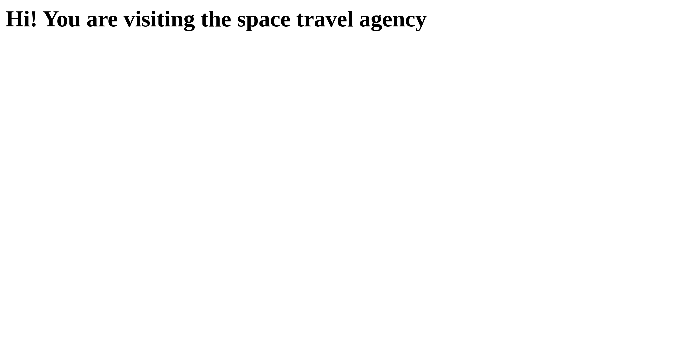
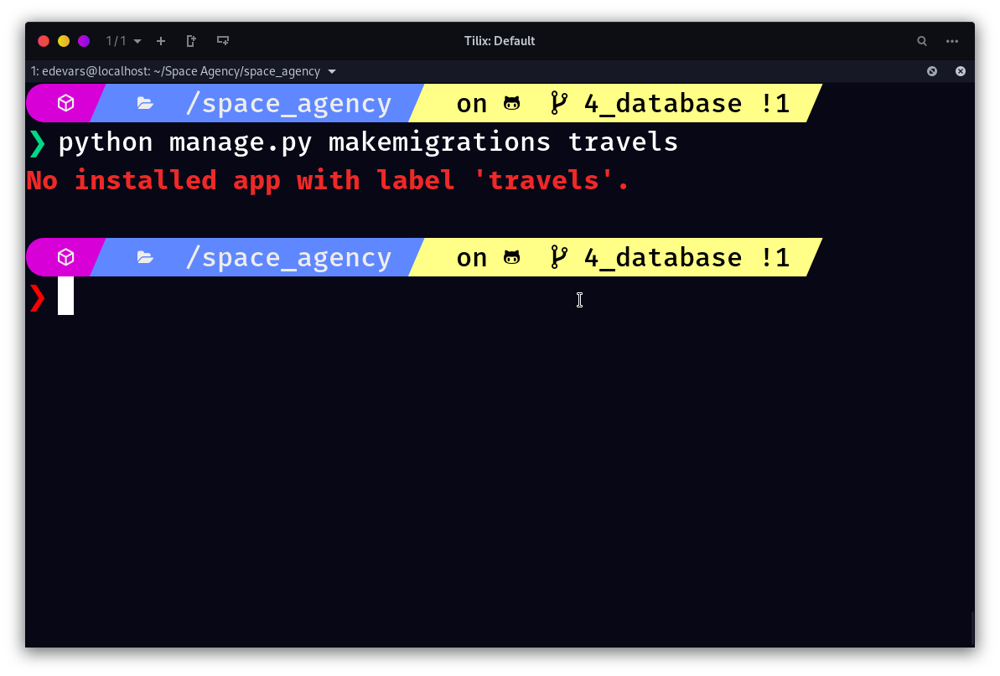
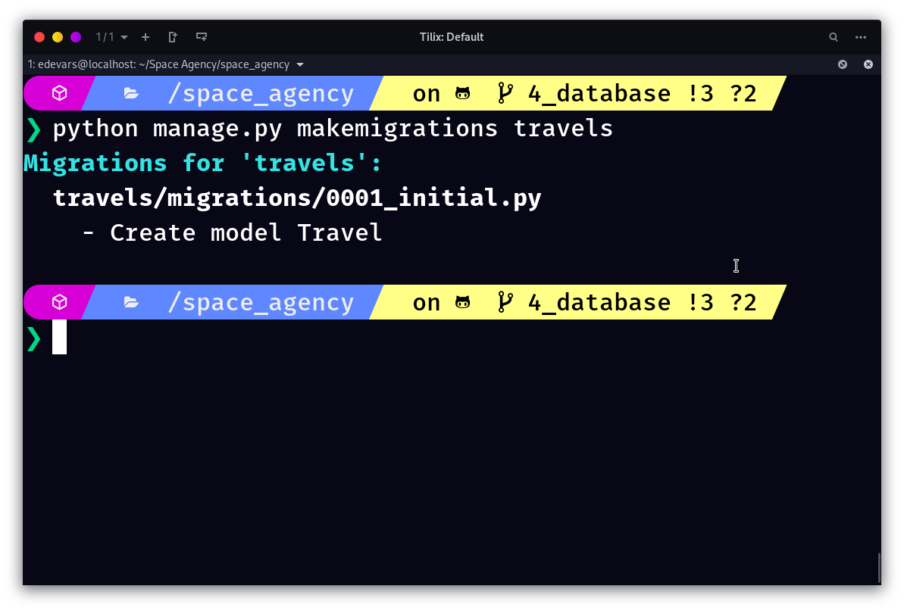

# KAPA-C | Space Travel Agency


#### A fiction project to learn Django creating a web app that controls all the travels from *KAPA-C*, the best travel agency in the galaxy!

---

## Table of contents

  * [Start a Django project](#start-a-django-project)
  * [Development server](#development-server)
  * [Creating our first app](#creating-our-first-app)
  * [MTV Pattern](#mtv-pattern)
  * [Creating our first view](#creating-our-first-view)
- [The magic of the Django ORM](#the-magic-of-the-django-orm)
  * [Space Travel Agency | ER Model](#space-travel-agency-er-model)
  * [Understanding what is a Model](#understanding-what-is-a-model)
  * [Creating our models](#creating-our-models)
- [Migrations in Django](#migrations-in-django)


### Start a Django project
Before we start coding and building the site for the best space travel agency, we need to setup all our enviroment. To do this we need to install the latest version of Django. I recommend you use a virtual enviroment. In my case I'm going to use conda as default package manager, but you can use pip if you prefer.

**Creating a virtual env**
```bash
conda create -n space_agency
```
and then
```bash
conda activate space_agency
```
**Installing Django**
```bash
conda install -c conda-forge django
```
**Creating a new Django project**
A Django project is a web aplication that do something in general, for example a blog, a news site, a social network, etc. To create this project we have to execute the next command.
```
django-admin startproject space_agency 
```

In this case `space_agency` is the name of our project. This command generates the next folders and files structure:
```
space_agency
    ├── manage.py
    └── space_agency
        ├── asgi.py
        ├── __init__.py
        ├── settings.py
        ├── urls.py
        └── wsgi.py
``` 

These files are:

- The outer **space_agency/** root directory is a container for your project. Its name doesn’t matter to Django; you can rename it to anything you like.
- **manage.py:** A command-line utility that lets you interact with this Django project in various ways. 
- The inner **space_agency/** directory is the actual Python package for your project. Its name is the Python package name you’ll need to use to import anything inside it (e.g. space_agency.urls).
- **space_agency/__init__.py:** An empty file that tells Python that this directory should be considered a Python package.
- **space_agency/settings.py:** Settings/configuration for this Django project. 
- **space_agency/urls.py:** The URL declarations for this Django project; a “table of contents” of your Django-powered site. 
- **space_agency/asgi.py:** An entry-point for ASGI-compatible web servers to serve your project. 
- **space_agency/wsgi.py:** An entry-point for WSGI-compatible web servers to serve your project. 

With this you have now a Django project initialized to create some apps inside.


### Development server
So we have all the setup of our project. If you can test that all the configuration works, run the manage.py script with the next instruction:
```bash
python manage.py runserver
```
This instruction runs the development server of our project. It's a light version of our web app that let us see the changes in our web pages in real time. 

To run in a specific port you can execute the command with an extra parameter. For example, if we can run our project in the port **3000**, we have to execute the next instruction: 
```bash
python manage.py runserver 3000
```

In both cases we are going to have the next output in the terminal:

```
Watching for file changes with StatReloader
Performing system checks...

System check identified no issues (0 silenced).

You have 18 unapplied migration(s). Your project may not work properly until you apply the migrations for app(s): admin, auth, contenttypes, sessions.
Run 'python manage.py migrate' to apply them.
September 05, 2020 - 23:22:45
Django version 3.1.1, using settings 'space_agency.settings'
Starting development server at http://127.0.0.1:3000/
Quit the server with CONTROL-C.

```

> ⚠ Remember activate your virtual environment and be inside the outer `space_agency` directory

Dont't worry about the migrations warning. This is an importatn concept in Django but we will see them later.  

If you click in the URL of the development server you can see something like this in your browser:


*The rocket in this page it's a mere coincidence*

### Creating our first app

In this moment it's posible that you think that a project and an application it's the same, but the reality is that this isn't true.

In the docs of Django says:
> An app is a Web application that does something – e.g., a Weblog system, a database of public records or a small poll app. A project is a collection of configuration and apps for a particular website. A project can contain multiple apps. An app can be in multiple projects.

Clear enough, right? So, if you understood this we can continue creating our first app. We can create the travels app, to do this we run the next command:

```bash
python manage.py startapp travels
```
This creates a new directory **travels** that has this structure:
 ```
 travels
├── admin.py
    ├── apps.py
    ├── __init__.py
    ├── migrations
    │   └── __init__.py
    ├── models.py
    ├── tests.py
    └── views.py
 ```
 This folder contains all the files of our travels app following the MTV pattern. 

 ### MTV Pattern

 The MTV Pattern is an important concept in Django. This a variation of the MVC pattern viewed in other languages like PHP. 

 
### Creating our first view

Views are python functions that take a web request and returns a web response. To create a view we can send an HTTP response in our travels app, for this we are going to use the `views.py` file.

**views.py**
```python
from django.http import HttpResponse 

def home(request): 
    dummy_html = "<h1> Hi! You are visiting the space travel agency</h1>"

    return HttpResponse(dummy_html)
```

This is a very basic view function, only lets us choose how we want to handle the data that is showing in the browser. To connect this response with a specific path or URL inside of our project, we need to create a `urls.py` file inside the travels app. This file configures which views you want to show in each URL. 

```python
from django.urls import path

from travels import views

urlpatterns = [
    path('', views.home, name='home'),
]
```

All the views that you declare inside of `urlpatterns` are going to live under a specific URL associated with the project. For this, we need to go inside of the `space_agency` directory and configure the news URLs from the travels app. 

```python
from django.contrib import admin
from django.urls import path, include

urlpatterns = [
    path('admin/', admin.site.urls),
    '''Adding the urls inside of the travels app'''
    path('travels/', include('travels.urls'))
]
```

Now, if you go to `http://127.0.0.1:8000/travels/` you can see the message created in your travels view.


## The magic of the Django ORM

If you are familiarized with the creation of web apps, you know that the configuration of a database is essential for big projects. Depending on which database you choose the backend implementation could be different, but the commons steps are that you need to set up the drivers to connect to the database and create the methods to do CRUD operations. 

In some frameworks exists the concept of ORM (Object Relation Mapper). This thing helps you to forget all that hard set up and only worry about you to create the models of your entities. Another big advantage is that the ORM let us to abstract all the logic of the creation of tables in the different relational database management systems (a.k.a RDBMS) like PostgreSQL or MySQL. 

> Note: Django can also work with No SQL databases like MongoDB

By Default Django use SQLite as a predefined database because it doesn't need to use another dependency to work with Python. Obviously, in production environments, this isn't a good practice. 

### Space Travel Agency ER Model

This is a basic diagram of the entities of our database. We have Travels, space ships, different kinds of seats, tickets and users.


### Understanding what is a Model

The models in Django have all the information about your data. They contain the fields and data types that are inserted as tables in the database, but all that process is handled by the Django ORM, its easy to work in this way. They are represented as a class in the code. 

### Creating our models

To start we are going to create the models of the travel app. 

> Remember, apps in Django are a kind of modules of your application. These can be used in other Django projects.

To do this, in the `Travel` app we have a file named `models.py`, inside of this we can write the specification of each model. Django includes a lot of data type fields to describe all the fields of the entities in our database. You can check all these data types [here](https://docs.djangoproject.com/en/3.1/ref/models/fields/).

First specify the `Travel` model:

```python
    class Travel(models.Model):
        destination = models.CharField(max_length=200)
        arrival_time = models.DateTimeField()
        departure_time = models.DateTimeField()
        image = models.ImageField()
```

As you can see, we use a special type field called `ImageField`. This data field will help us later to upload images in our application, in combination with the dependency `pillow`. We will configure this later. 

To apply this model to our database we need to understand a new concept, migrations. 

## Migrations in Django 

Migrations are the way to propagate the changes in your models into the schema of your database. As simple as that. 🥳

To apply the `Travel` model to the schema we need to run the command `makemigrations` specifying our app. 

```bash
python manage.py makemigrations travels
```

Buy then you are going to see this error in the console. 



So... to fix this we need to install the `travels` app in the Django project. This is really simple, go inside the main `space_agency` folder and look for the `settings.py` file. Go directly to this line: 

```python
# Application definition

INSTALLED_APPS = [
    'django.contrib.admin',
    'django.contrib.auth',
    'django.contrib.contenttypes',
    'django.contrib.sessions',
    'django.contrib.messages',
    'django.contrib.staticfiles',
]
```

and then add the name of the app that you want to install. In our case is the `travels` app.

```python
# Application definition

INSTALLED_APPS = [
    'django.contrib.admin',
    'django.contrib.auth',
    'django.contrib.contenttypes',
    'django.contrib.sessions',
    'django.contrib.messages',
    'django.contrib.staticfiles',
    # adding the travels app
    'travels' 
]
```

Now, try to execute the `makemigrations` command again. If all was ok, you see a message like this in your terminal. 

```bash
python manage.py makemigrations travels
```



if you look inside of your project, you have a new file inside in the migrations folder. This file is generated automatically by Django whenever you do a modification to your models. 

But this isn't all, you need to apply this migration to your project. To do this only execute the command 'migrate' with the manager of Django. 

```bash
python manage.py migrate
```

With this you have been applied all the changes to your database, no matters if is SQLite or PostgreSQL, this is the magic behind Django ORM. 