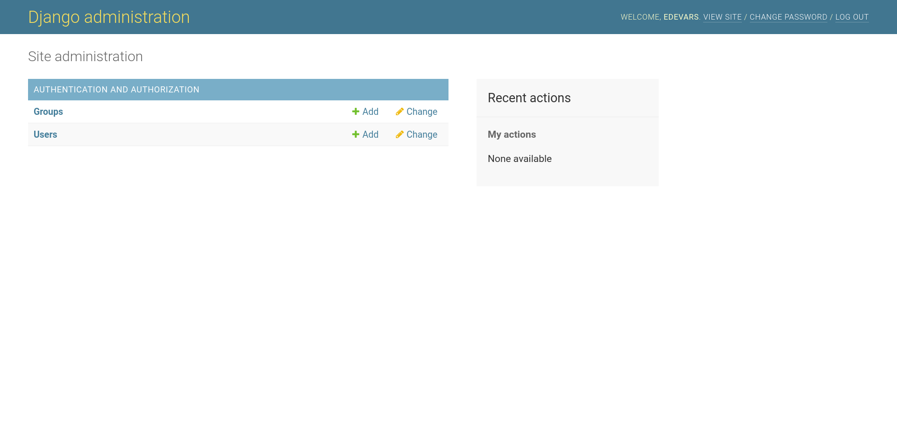

# KAPA-C | Space Travel Agency


#### A fiction project to learn Django creating a web app that controls all the travels from *KAPA-C*, the best travel agency in the galaxy!

---

## The Django Admin

For me, the Django Admin is the most incredible thing about this framework. The Django Admin provides us a simple interface to see, create, modify, and delete all our models. It's a very basic but powerful frontend interface to do CRUD operations. 

First, we need to create a superuser to access to the admin. For this only execute the create `createsuperuser` with the manager and fill all the required fields. 

```bash
python manage.py createsuperuser
```

Now run the development server and go to the `http://127.0.0.1:8000/admin` URL. You can see the next screen, fill the info with the user that you created. 


Now you have access to the Django Admin! It's really easy. **UwU**



If you look to the models available to change, we don't have access to modify the Travel model. This is because we didn't add it, to add the travel model we need to import it inside of the `admin.py` file. It's inside of the `Travels` app. 

```python
# travels/admin.py  
from django.contrib import admin
from .models import Travel

# Register your models here.
admin.site.register(Travel) 
```
This is the most basic way to register a model but has a few disadvantages. Now you can add travels inside of the admin. Only reload the page and now you have the `travels` app registered. The next step is to go to the travel page and create a new one. 


As you can see, when you create a trip the frontend page isn't very friendly. Only display us the Travel Object.


To change this we need to create a custom Django Admin view. This is very easy. To do this go again to the `admin.py` file and modify it. 

```python
# travels/admin.py  
from django.contrib import admin
from .models import Travel

# Register your models here.
@admin.register(Travel)
class AuthorAdmin(admin.ModelAdmin):
    list_display = ('pk', 'destination','arrival_time','departure_time', 'image')

```
Now reload the page and 🥳, you have a custom view for the Django Admin. If you want to know how to customize deeply, you can check the [official documentation](https://docs.djangoproject.com/en/3.1/ref/contrib/admin/) of Django. 


